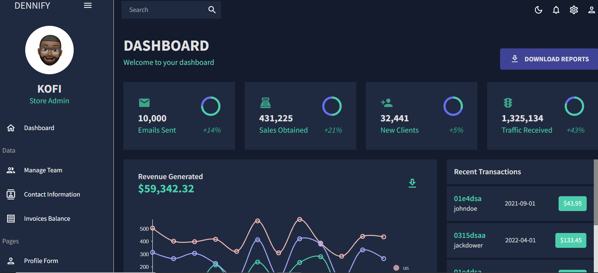

<div align="center">
  <p align="center">
    Bookify
    <br />
    <a href="https://github.com/dennisappiahALX/dennify-dashboard"><strong>Explore the docs »</strong></a>
    <br />
    <br />
  </p>
</div>

<!-- ABOUT THE PROJECT -->

## About The Project



# What it does

An imaginary e-commerce admin dashboard built with react-typescript , material-ui, full-calender for managing events, formik-yup for form validation and data-grid for display of data

# Built With

This section should list any major frameworks/libraries used to bootstrap your project. Leave any add-ons/plugins for the acknowledgements section. Here are a few examples.

- [React.js](https://reactjs.org/)
- [React-Material UI](https://mui.com/)

# Getting started

The project consist of the backend and also the front end.

### Prerequisites

- nodejs installed
- npm

```
npm install npm@latest -g

```

### Local setup

To run this project locally, follow these steps.

1. Clone the project locally, change into the directory, and install the dependencies:

```
git clone https://github.com/dennisappiahALX/dennify-dashboard

cd nftproject

# install using NPM or Yarn
npm install

# or

yarn
```

2. Start the local Hardhat node

```sh
npx hardhat node
```

3. With the network running, deploy the contracts to the local network in a separate terminal window

```sh
npx hardhat run scripts/deploy.js --network localhost
```

4. Start the app

```
npm run dev
```

If you have a suggestion that would make this better, please fork the repo and create a pull request. You can also simply open an issue with the tag "enhancement". Don't forget to give the project a star! Thanks again!

1. Fork the Project
2. Create your Feature Branch (`git checkout -b feature/AmazingFeature`)
3. Commit your Changes (`git commit -m 'Add some AmazingFeature'`)
4. Push to the Branch (`git push origin feature/AmazingFeature`)
5. Open a Pull Request

# License

Distributed under the MIT License.
